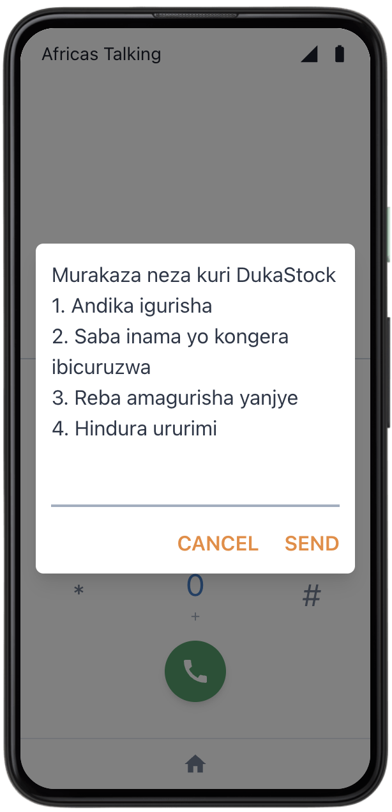
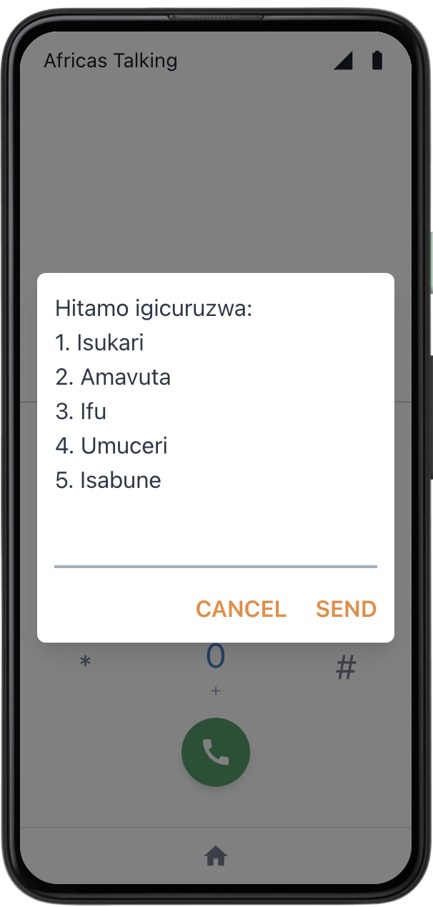
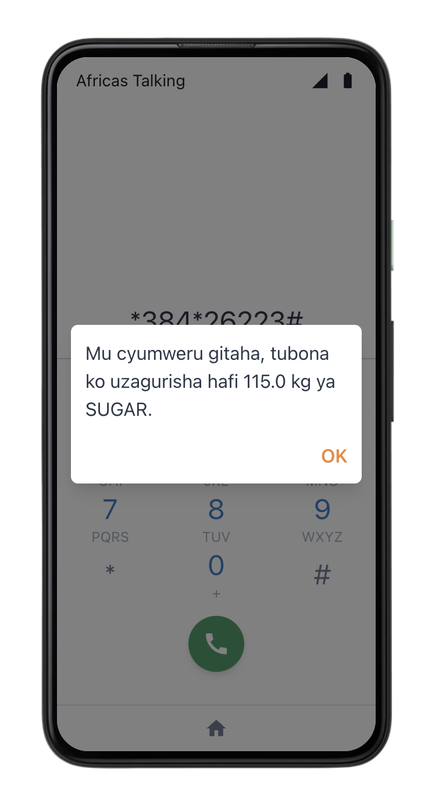
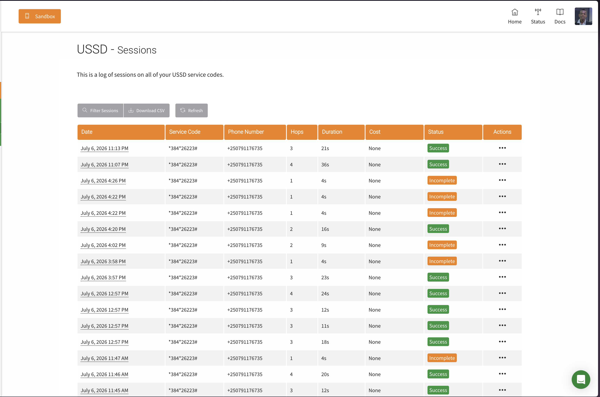
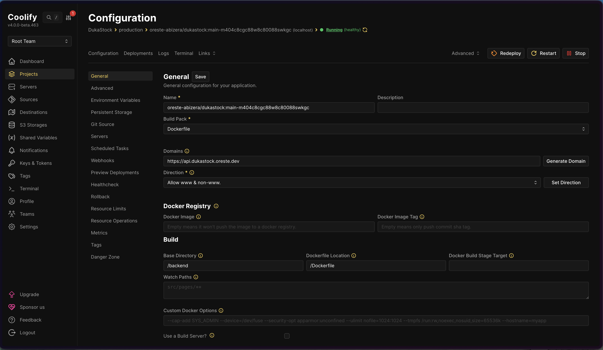
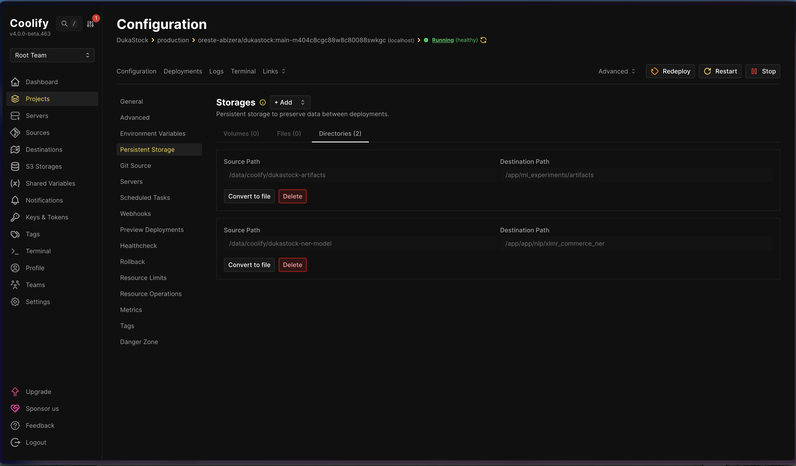
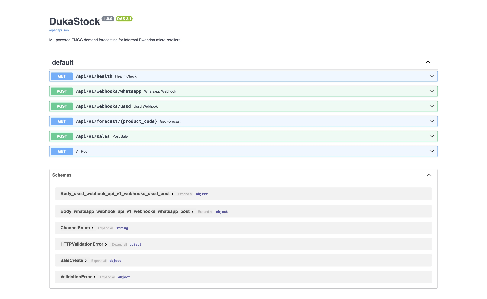
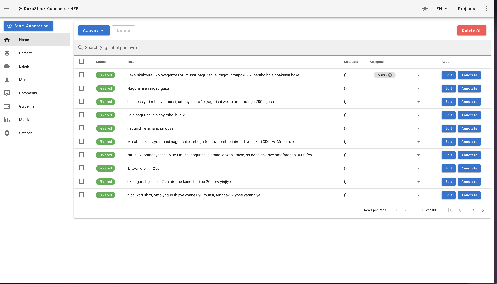
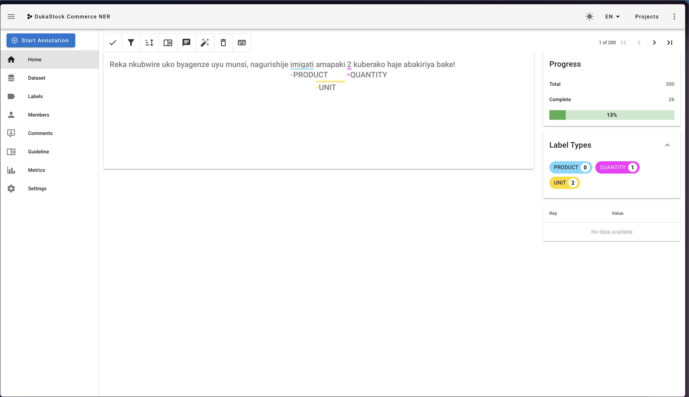

# Testing Results

Evidence for the assignment's "Testing Results" requirement, organized by
the three demonstration types asked for: different testing strategies,
different data values, and performance across hardware/software
environments.

Everything below was actually executed and verified live on **2026-07-06**
— the automated tests, all API calls against the production deployment
at `https://api.dukastock.oreste.dev`, and the accompanying screenshots
(a real phone's WhatsApp conversation spanning two days, the Coolify
dashboard, Swagger UI, and Africa's Talking's USSD simulator and real
session log).

---

## 1. Testing under different strategies

### 1.1 Automated test suite (unit + API-level)

```
$ cd backend && DATABASE_URL="sqlite:///./test.db" PYTHONPATH=. pytest tests/unit/ -q
======================= 97 passed, 2 warnings in 27.43s ========================
```

97 tests covering: metrics (RMSE/MAE/MAPE/sMAPE, Diebold-Mariano), all 5
model classes, the NER pipeline (RapidFuzz baseline), the USSD FSM
(sales logging, forecast lookup, sales history, language switching), the
personalized forecasting service, sales aggregation, and real
`TestClient` HTTP-layer tests hitting the actual webhook/forecast/sales
endpoints.

*(Terminal screenshot of this run not included — the transcript above is
the verified real output.)*

### 1.2 Live production API testing (curl)

Health check:
```
$ curl https://api.dukastock.oreste.dev/api/v1/health
{"status":"ok","service":"dukastock-backend"}
```

WhatsApp webhook — real fine-tuned XLM-R model, multi-entity extraction
in one message:
```
$ curl -X POST https://api.dukastock.oreste.dev/api/v1/webhooks/whatsapp \
    -d "From=whatsapp%3A%2B250788999001" \
    -d "Body=Nabagurishije+isukari+ibiro+bitatu+namavuta+litre+imwe"
<Response><Message>Murakoze! Twanditse: SUGAR 3 kg. Murakoze! Twanditse: OIL 1 litre.</Message></Response>
```

USSD webhook — dial-in menu:
```
$ curl -X POST https://api.dukastock.oreste.dev/api/v1/webhooks/ussd \
    -d "sessionId=readme-demo-1&phoneNumber=%2B250788222333&text="
CON Murakaza neza kuri DukaStock
1. Andika igurisha
2. Saba inama yo kongera ibicuruzwa
3. Reba amagurisha yanjye
4. Hindura ururimi
```

Same flow via Africa's Talking's USSD simulator, dialing the sandbox
service code end to end:









### 1.3 Real device / real messaging platform testing








### 1.4 Real NER annotation in progress (RQ2 data collection)

200 real messages were collected directly from Duka shopkeepers and are
being annotated span-by-span (PRODUCT/QUANTITY/UNIT) in Doccano, running
locally per `docs/ANNOTATION_GUIDE.md`:





---

## 2. Testing with different data values

### 2.1 Different products, quantities, units

Already demonstrated above (SUGAR 3kg + OIL 1 litre in one message). Also
covered by the automated test suite across all 5 canonical products
(SUGAR, OIL, FLOUR, RICE, SOAP) and arbitrary off-menu products (e.g. the
NER pipeline correctly leaves an unrecognized product like "inyama"/meat
un-canonicalized rather than misclassifying it).

### 2.2 Language switching (Kinyarwanda / English)

```
$ curl -X POST .../webhooks/ussd -d "sessionId=demo&phoneNumber=...&text=4"
CON Hitamo ururimi:
1. Ikinyarwanda
2. Icyongereza

$ curl -X POST .../webhooks/ussd -d "sessionId=demo&phoneNumber=...&text=4*2"
END Language changed to English.

$ curl -X POST .../webhooks/ussd -d "sessionId=new-session&phoneNumber=...&text="
CON Welcome to DukaStock
1. Log a sale
2. Request restocking advice
3. View my sales
4. Change language
```

Confirms the language preference persists across sessions for the same
shopkeeper (stored on `ShopkeeperProfile.locale`), affecting every menu,
prompt, and confirmation message.

### 2.3 Personalized vs. global forecast (different data density per shopkeeper)

A shopkeeper with 100 days of seeded sales history gets a different,
personalized result (`naive`, 204.7 kg) than the shared global model
(`xgboost`, 115.02 kg) for the same product:

```
$ curl .../forecast/SUGAR
{"model_used":"xgboost","predicted_quantity":115.02, ...}

$ curl ".../forecast/SUGAR?shopkeeper_id=<seeded-shopkeeper-uuid>"
{"model_used":"naive","predicted_quantity":204.7, ...}

$ curl ".../forecast/SUGAR?shopkeeper_id=<brand-new-shopkeeper-uuid>"
{"model_used":"xgboost","predicted_quantity":115.02, ...}   # correctly falls back to global
```

### 2.4 Invalid / edge-case input

Covered by automated tests: non-numeric quantity input on USSD
re-prompts instead of crashing (`test_invalid_quantity_input_reprompts`),
an unrecognized WhatsApp message returns a graceful "couldn't understand"
reply instead of a 500 (`sale_not_understood_message`), and a forecast
request for a product with no trained model returns an explicit
`"no_model"` status rather than a misleading `0.0`.

---

## 3. Performance across different hardware/software environments

| Environment | Where used | What ran there |
|---|---|---|
| macOS + Apple Silicon (MPS GPU) | Local development machine | XLM-R fine-tuning (10 epochs, 200-message set, in **~7.5 minutes** via MPS acceleration) |
| Linux VPS + CPU only | Coolify production container | XLM-R inference at request time (confirmed via production logs: `Device set to use cpu`) — same model artifact, different hardware, both verified working |
| SQLite | Local dev + automated test suite | All 97 tests run against an isolated in-memory/file SQLite DB |
| PostgreSQL | Coolify production | Real Postgres resource, Alembic migrations verified running against it live |
| Docker Compose (local) | Local full-stack dev | `docker-compose.yml` — Postgres + Redis + backend, verified as a parity check against production's stack |
| Coolify (remote, containerized, HTTPS) | Production | Full deployment behind Let's Encrypt via Coolify's reverse proxy — see `RUNBOOK.md` Section 13 |

*(Terminal screenshot of the training run not included — the real
`train_runtime` figure from that session is quoted directly in the table
above.)*
